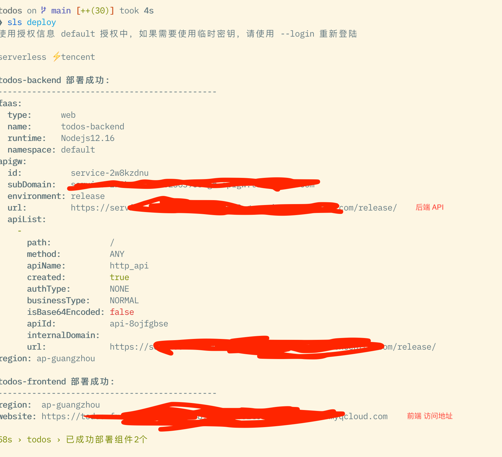
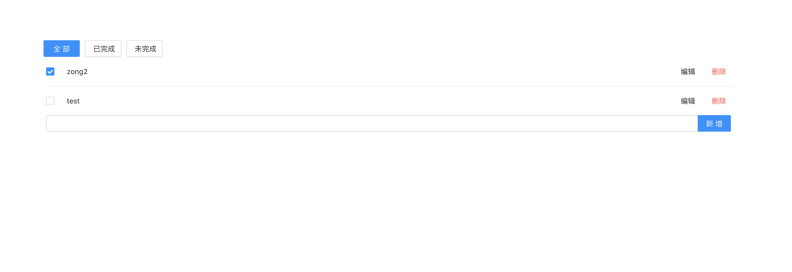

## 基于 Serverless CLI 和腾讯云的 Todo List 应用

### 前置条件

1. `Node.js` >= 12
2. [安装](https://cn.serverless.com/framework/docs-getting-started) `serverless` 命令行工具
3. [注册](https://cloud.tencent.com/register)腾讯云账号并[开通](https://cloud.tencent.com/document/product/1154/43006)权限
4. 开通[腾讯云 Redis 数据库](https://cloud.tencent.com/document/product/239/30821)

### 使用流程

-   根目录中新建 `.env`文件，填写`redis` 数据库信息，以及网络配置, 具体步骤和架构请参考下面的**项目架构**部分
-   根目录执行 `sls deploy`, 命令行会自动分别部署`backend, frontend` 项目
-   打开 `todos-frontend` 输出的 `website` 地址即可看到项目前端，进行操作

### 项目架构

此 **Todo List** 项目采取前后端分离的架构，前端提供页面 Ui 展示和功能操作， 后端提供 API 和数据库操作. 项目提供了:

1. 新增 Todo
2. 切换 Todo 状态
3. 修改 Todo 信息
4. 删除 Todo
5. 为 Todo 添加截至日期

根目录`serverless.yml`定义了`app, stage` 字段，因为需要确保模版下的组件使用相同的`app, stage` 字段，用户可自行修改需要的值

#### 后端结构

`backend` 文件夹中即为后端项目目录:

-   使用腾讯云 Redis 作为 Todo 数据存储
-   使用[tencent-http](https://github.com/serverless-components/tencent-http) + [koajs](https://koajs.com/) 作为技术选型

首先需要手动在腾讯云开通和配置**redis**数据库, 参考: https://cloud.tencent.com/document/product/239/30821。 在腾讯云成功开通 **Redis** 数据库之后，在项目根目录新建 `.env` 文件，然后将数据库的 `host, port, password` 存在`.env`, 同时需要将配置的**所属网络(必须和项目所在区域相同)，所属子网**的字段配置在`.env`中:

```bash
redis_port=xxxx
redis_host=xxxx
redis_password=xxxx
vpcId=xxxx
subnetId=xxxx
```

后端项目成功部署后，会在腾讯云 scf 中自动部署一个名为`todos-backend`的项目，用户可在其中查看日志或者函数配置

**注意事项**:

-   Redis 数据库的开通地域需要和项目的部署地域相同，比如`backend/serverless.yml` 中的**region**为*shanghai*, Redis 也需要在*shanghai*地域开通，并且保证配置合理互通的网络，[参考](https://cloud.tencent.com/document/product/239/30910)
-   要为 redis 配置网络的话，需要有一个和 redis 所属地区完全相同的网络配置才可以找到。比如 Redis 在上海一区，那么需要有一个属于上海一区的子网，才可以为 redis 进行分配。

#### 前端结构

`frontend` 文件夹中即为前端项目目录:

-   使用[tencent-website](https://github.com/serverless-components/tencent-website) 作为项目框架
-   使用 `React` + `Ant.design` + `ky` 作为技术选型

`frontend/serverless.yml` 中使用了`backend` 项目提供的后端 ApiUrl`${output:${stage}:${app}:todos-backend.apigw.url}`, 其中`todos-backend` 是后端项目的名称，如果后端项目的名称被修改，前端`yml`中此处的值需要对应修改。 可以做到无缝部署，不需要分别部署.
前端项目部署之后会将静态资源存在 COS 的`todos-frontend`bucket 中，可以自行在`serverless.yml`中修改

#### 本地开发

1. `sls deploy` 之后，会在用户的`todos-frontend` bucket 生成一个 `env.js` 文件，需要将其下载到`frontend/public` 文件夹中。 之所以在本地开发的时候需要这个文件是因为这个文件会把后端 API 的地址自动注入`window.env` 中，供前端 API 访问使用， 所以本地开发的时候需要手动下载。 线上项目会自动获取。
2. 进入`frontend`文件夹下，执行`npm install` 安装依赖
3. 执行 `npm start` 本地运行项目

### 效果截图

-   项目命令行部署: 
-   前端 Todo 展示全部数据: 
-   展示已完成数据: 
-   展示未完成数据: 
-   数据编辑: 
-   **超过**截止日期还**未完成**的 Todo, 显示**红色提醒图标**: 
